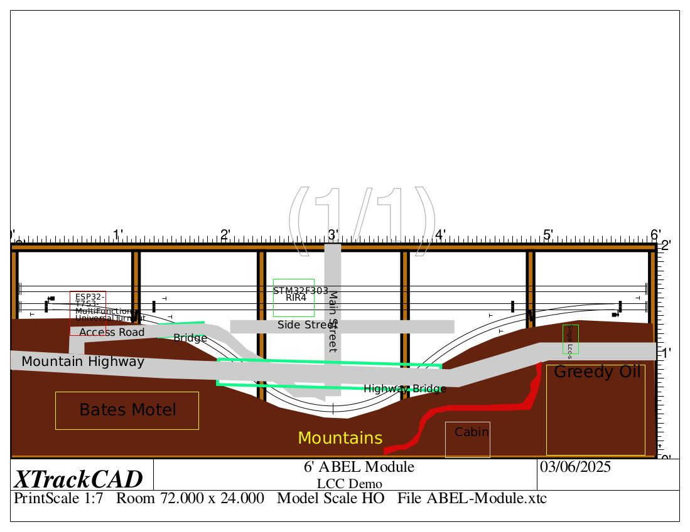
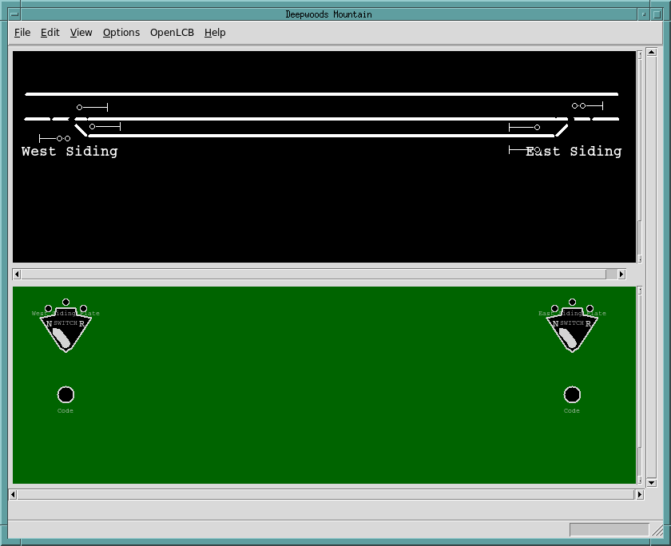

# Amherst Belt Lines LCC Demo Module

- Module layout: 
- CTC Panel: 

## Features

The module features a mountain cliff at the back of the module, with a siding
on track 2 that curves along the cliff.  The turnouts at the ends of the siding
are controlled by a LCC board.  Both turnouts are protected by signals that are
also managed by LCC board.  There is a small town at the front center of 
the module that includes an automatic  level grade crossing protected by 
lights and gates.  In the town is a pool hall with an automated lighted sign, 
a hotel, a warehouse and other buildings,

Up on the mountain cliff is a highway that includes a bridge over the back of 
the town and siding.  Also along the highway is a motel with a lighted sign
and a modern gas station / mini-mart with a lighted text-base sign, displaying
gas prices and other information, including a clock.

## Layout Command Control (LCC) boards

- Deepwoods Software ESP32-T7S3-MultiFunction-UniversalTurnout, with Stall 
  Motor Daughter board
  - 4 Occupancy detectors (all 4 in use: both OS sections and track2 between
    turnouts and the siding).
  - 4 Turnout drivers w/ point sense (2 in use: both turnouts)
  - 4 GP Drivers (none in use)
  - 4 Pushbutton inputs (none in use)
  - 16 Signal lamp (PWM LED) drivers, 12 in use for CP1's signals)
  
- RR-CirKits Signal-LCC-s
  - 8 GPIO lines (none in use)
  - 16 Signal lamp (PWM LED) drivers, 12 in use for CP2's signals)

- Deepwoods Software STM32F303 RIR4 base board w/ STM32F303 and 2x Azatraz 
  RIR4s -- used for grade crossing

- 2x Deepwoods Software ESP32-Mini32-OctalBuffer
  - One for the 8-Ball Club sign and the warehouse and hotel lights
  - The other for Bates Motel and forest cabin lights
  
- Deepwoods Software ESP32 Dev-board breaboarded text display -- Greedy Oil

- LCC-Buffer USB -- connected to Raspberry Pi

- Raspberry Pi 4 w/ touchsreen monitor for CTC panel.

## Other electrical mechanical

- 4x Circuitron Tortoise (two for the turnouts and two for the crossing gates)
- 2x dual head (3 over 3) color light signals
- 4x single head 3 color light signals
- 2x crossing gates w/lights
- 1x bell unit for grade crossing

## Software used

- Model Railroad System

  - Dispatcher panel on RPi
  - OpenLCB/OpenLCB2 on the RPi (configuring nodes)
  
- OpenMRN

  - ESP32-S3-MultiFunctionOpenMRNIDF
  - ESP32-OctalBufferOpenMRNIDF
  - ESP32-T7S3-TextDisplaySign/firmware
  - STM32F303-RIR4/firmware/targets/freertos.armv7m.st-stm32f303re-nucleo-standardcrssing-2shields
